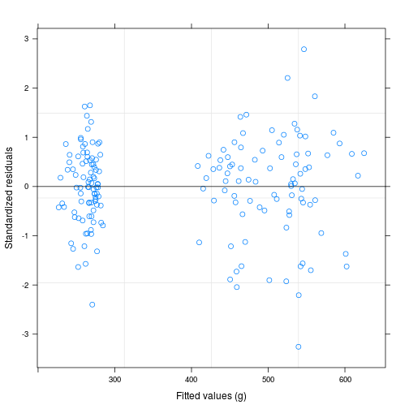
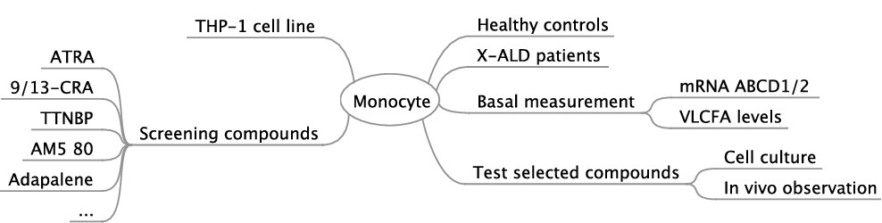
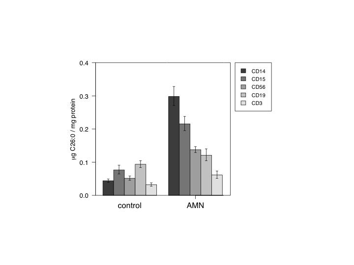
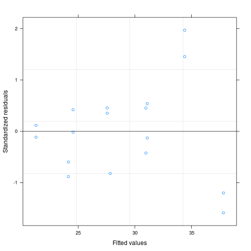

Using linear models in data analysis
========================================================
author: Willi Weber
date: 24.5.2016
autosize: true

outline
========================================================

- how to make your result a reproducible research?
- tools like rstudio combined with knitr or sweave available
- if you found your way stick to it!
- combine explaining text with programming steps.
- measurements are the holy data stored separately best in a data base.
- excel most common
- git version control including the data into your projectfile

objectives
=================================================
1. hierarchical data
2. drug concentration effect on gene expression?
2. target cells: culture - in vivo


Introduction
========================================================

- my experience within molecular biology
- my conclusion: use simpliest possible statistics
- leads to
 + exploratory data analysis
 + linear models
 + barplots
- anova often used in molecular biology

Analysis of variance
===============================================

- continous response related to classification factors aov
- + additionally to a continous covariate lme

Analysis of variance:
$$y_{i,j} = \beta_i + \epsilon_{i,j}, i=1 \dots M; j=1 \dots n_i$$

$$y_{i,j} = \overline{\beta}+ (\beta_i - \overline{\beta}) + \epsilon_{i,j}$$

Analysis of covariance:
$$y_{i,j} = \beta_1 + b_i + \beta_2 x_{i,j} + \epsilon_{i,j}, i=1 \dots M; j=1 \dots n_i$$
$$ b_i \~ N(0,\sigma_b^2),  \epsilon_{i,j} \~ N(0,\sigma^2)$$


Simulate ANOVA
====================================================

## Introduction 
- continous response ~ one factor (n levels)
- anova, $F_{value} = \frac{between}{within}$ group variance
- aov, linear model (lm)

R data.frame with between group data
===================================================
### single observation per subject ID
<small>

```r
nid<-3 # n per group
wtm<-c(male=80,female=60,boys=40,girls=38)
wtOmega<-0.15
groups<-factor(rep(names(wtm),each=nid),levels=names(wtm))
dd<-data.frame(ID=as.factor(seq(along=groups)),groups)
set.seed(2052016)
dd$WT<-wtm[groups]*exp(wtOmega*rnorm(length(dd$ID)))
g1<-dd
summary(dd)
```

```
       ID       groups        WT       
 1      :1   male  :3   Min.   :31.92  
 2      :1   female:3   1st Qu.:38.39  
 3      :1   boys  :3   Median :49.38  
 4      :1   girls :3   Mean   :54.14  
 5      :1              3rd Qu.:71.73  
 6      :1              Max.   :85.43  
 (Other):6                             
```
</small>

one way ANOVA analysis
================================================== 
<small>

```r
summary(a1<-aov(WT ~ groups + Error(ID),data=dd))
```

```

Error: ID
          Df Sum Sq Mean Sq F value   Pr(>F)    
groups     3   3631  1210.4   21.86 0.000329 ***
Residuals  8    443    55.4                     
---
Signif. codes:  0 '***' 0.001 '**' 0.01 '*' 0.05 '.' 0.1 ' ' 1
```
</small>

how to report the Anova results:
====================================================
“We performed a one-way independent samples ANOVA with weight (WT) as reponse and the 
factor Group (four levels: males, females, boys, girls) as fixed effect and the random factor
Subjects (ID). There was a significant effect of Group (F(3,8)= 21.86 , p<0.0001) on the response WT.”

Anova using lm linear model
=================================================
<small>

```r
dd.lm<-lm(WT~groups,dd)
ddlm.tab<-summary(dd.lm)
names(ddlm.tab$fstat)[1]<-"F_value"
coef(ddlm.tab)
```

```
              Estimate Std. Error   t value     Pr(>|t|)
(Intercept)   76.86949   4.296204 17.892422 9.755907e-08
groupsfemale -12.82155   6.075749 -2.110283 6.784344e-02
groupsboys   -33.42360   6.075749 -5.501149 5.729672e-04
groupsgirls  -44.66607   6.075749 -7.351533 7.982118e-05
```
</small>
lm and aov result in same F_value 21.858929


Weight: repeated observation data
=================================================


two step method: 1. individual mean of 3 weights 2. lm using the means
****

 problems with degrees of freedom and in case of unblanced data
 
 
lme: compromise between lm and lmList
==================================================
between subject variability 0.15, residual error 0.1 assumed 
<small>

```
                lower     est.    upper
groupsmale   64.48573 79.17834 97.21856
groupsfemale 51.84187 63.65367 78.15671
groupsboys   36.17123 44.41259 54.53168
groupsgirls  25.38674 31.17092 38.27300
attr(,"label")
[1] "Fixed effects:"
```

```
$ID
                     lower      est.     upper
sd((Intercept)) 0.08200026 0.1440053 0.2528958

attr(,"label")
[1] "Random Effects:"
```

```
     lower       est.      upper 
0.07186281 0.09535960 0.12653908 
attr(,"label")
[1] "Within-group standard error:"
```
</small>


lme: male as reference, WT difference between male and female?
===========================================
<small>

```
              Value Std.Error DF t-value  p-value
(Intercept)   4.370     0.089 24   49.10 1.35e-25
groupsfemale -0.218     0.126  8   -1.73 1.21e-01
groupsboys   -0.578     0.126  8   -4.59 1.77e-03
groupsgirls  -0.932     0.126  8   -7.41 7.58e-05
```

```
              lower   est.  upper
(Intercept)   4.190  4.370  4.560
groupsfemale -0.509 -0.218  0.072
groupsboys   -0.868 -0.578 -0.288
groupsgirls  -1.220 -0.932 -0.642
attr(,"label")
[1] "Fixed effects:"
```
difference between male and female not significant (p=0.12)
</small>  
```
difference between male and female not significant (p=0.12)
</small>


lme: girls as reference, WT difference between girls and boys?
=================================================
<small>

```
                             Value Std.Error DF t-value  p-value
(Intercept)                  3.440     0.089 24   38.60 3.99e-23
C(groups, "contr.SAS")male   0.932     0.126  8    7.41 7.58e-05
C(groups, "contr.SAS")female 0.714     0.126  8    5.67 4.69e-04
C(groups, "contr.SAS")boys   0.354     0.126  8    2.81 2.28e-02
```

```
                                 lower     est.    upper
(Intercept)                  3.2557800 3.439490 3.623190
C(groups, "contr.SAS")male   0.6419370 0.932217 1.222500
C(groups, "contr.SAS")female 0.4236910 0.713971 1.004250
C(groups, "contr.SAS")boys   0.0637573 0.354037 0.644317
attr(,"label")
[1] "Fixed effects:"
```
significant difference between girls and boys
</small>

growth of rats for three different diets
=======================================================

```r
formula(BodyWeight)
```

```
weight ~ Time | Rat
```

```r
plot(BodyWeight,outer=T,aspect=3,key=F)
```


```r
head(bw0<-BodyWeight)
```

```
Grouped Data: weight ~ Time | Rat
  weight Time Rat Diet
1    240    1   1    1
2    250    8   1    1
3    255   15   1    1
4    260   22   1    1
5    262   29   1    1
6    258   36   1    1
```

```r
#aov(BodyWeight)
bw1<-subset(BodyWeight,Time<9)
head(bw1)
```

```
Grouped Data: weight ~ Time | Rat
   weight Time Rat Diet
1     240    1   1    1
2     250    8   1    1
12    225    1   2    1
13    230    8   2    1
23    245    1   3    1
24    250    8   3    1
```

```r
plot(bw1,aspect="fill")
```


lmList 
======================================================

```r
bw.lmlist<-lmList(BodyWeight)
plot(intervals(bw.lmlist))
```


lme with interaction
=========================================================

```r
bw0.lme<-lme(bw.lmlist)
bw1.lme<-update(bw0.lme,.~Time*Diet)
summary(bw1.lme)
```

```
Linear mixed-effects model fit by REML
 Data: BodyWeight 
      AIC      BIC    logLik
  1171.72 1203.078 -575.8599

Random effects:
 Formula: ~Time | Rat
 Structure: General positive-definite, Log-Cholesky parametrization
            StdDev     Corr  
(Intercept) 36.9390723 (Intr)
Time         0.2484113 -0.149
Residual     4.4436052       

Fixed effects: weight ~ Time + Diet + Time:Diet 
                Value Std.Error  DF   t-value p-value
(Intercept) 251.65165 13.094025 157 19.218816  0.0000
Time          0.35964  0.091140 157  3.946019  0.0001
Diet2       200.66549 22.679516  13  8.847873  0.0000
Diet3       252.07168 22.679516  13 11.114509  0.0000
Time:Diet2    0.60584  0.157859 157  3.837858  0.0002
Time:Diet3    0.29834  0.157859 157  1.889903  0.0606
 Correlation: 
           (Intr) Time   Diet2  Diet3  Tm:Dt2
Time       -0.160                            
Diet2      -0.577  0.092                     
Diet3      -0.577  0.092  0.333              
Time:Diet2  0.092 -0.577 -0.160 -0.053       
Time:Diet3  0.092 -0.577 -0.053 -0.160  0.333

Standardized Within-Group Residuals:
        Min          Q1         Med          Q3         Max 
-3.25558796 -0.42196874  0.08229384  0.59933559  2.78994477 

Number of Observations: 176
Number of Groups: 16 
```
lme with interaction,table
====================================================


```r
summary(bw1.lme)$tTable
```

```
                  Value   Std.Error  DF   t-value      p-value
(Intercept) 251.6516516 13.09402485 157 19.218816 4.328042e-43
Time          0.3596391  0.09113974 157  3.946019 1.195605e-04
Diet2       200.6654865 22.67951631  13  8.847873 7.300067e-07
Diet3       252.0716778 22.67951631  13 11.114509 5.211367e-08
Time:Diet2    0.6058392  0.15785866 157  3.837858 1.795165e-04
Time:Diet3    0.2983375  0.15785866 157  1.889903 6.061410e-02
```

lme with interaction,residuals
====================================================


```r
plot(bw1.lme)
```



using aov
=============================================

```r
summary(a3<-aov(weight ~ Diet*Time +Error(Rat),data=BodyWeight))
```

```

Error: Rat
          Df  Sum Sq Mean Sq F value   Pr(>F)    
Diet       2 2604050 1302025   88.07 2.76e-08 ***
Residuals 13  192186   14784                     
---
Signif. codes:  0 '***' 0.001 '**' 0.01 '*' 0.05 '.' 0.1 ' ' 1

Error: Within
           Df Sum Sq Mean Sq F value Pr(>F)    
Time        1  22847   22847  557.03 <2e-16 ***
Diet:Time   2   4190    2095   51.08 <2e-16 ***
Residuals 157   6439      41                   
---
Signif. codes:  0 '***' 0.001 '**' 0.01 '*' 0.05 '.' 0.1 ' ' 1
```


example: X-linked Adrenoleucodystrophy
===========================================================

- long chain fatty acids must cross the membrane by peroximal transporters to the metabolizing enzymes

Work plan
=================================================


ABCD1 defect damage monocytes
===============================================

****


learnings
================================================================
- assay control samples
- analyse study data together
- excel serves as data base, statistic script and calculator
- knitr additionally supports writing reproducible reports

evaluation of candidate drugs to induce ABCD2 in monocytes
==========================================================
## assay calibration
- experimental design: cellculture of THP1 monocyte cell line
- linearized plasmids p1559
- concentration determined using assay nanodrop
- dilution sequence used as calibration samples

read calibration data from excel
============================================================


log transform -> linear model:
***

 $TC \~(log10(SQ)-3)|Gene$ 


linear regression separately for each gene 
====================================================== 
<small>

```
Call:
  Model: TC ~ I(log10(SQ) - 3) | factor(Gene) 
   Data: calibLog 

Coefficients:
   (Intercept) 
      Estimate Std. Error  t value     Pr(>|t|)
HPRT  30.97400  0.1227420 252.3505 2.242151e-25
ABCD2 27.81824  0.1630532 170.6083 3.631421e-23
   I(log10(SQ) - 3) 
       Estimate Std. Error   t value     Pr(>|t|)
HPRT  -3.421000 0.08679169 -39.41622 6.479292e-15
ABCD2 -3.271912 0.12453393 -26.27325 1.186902e-12

Residual standard error: 0.3881442 on 13 degrees of freedom
```
</small>
same slope for both genes
=====================================================

***


linear model 
==================================================

```
Analysis of Variance Table

Model 1: TC ~ Gene + I(log10(SQ) - 3)
Model 2: TC ~ Gene + I(log10(SQ) - 3) + Gene:I(log10(SQ) - 3)
  Res.Df    RSS Df Sum of Sq      F Pr(>F)
1     14 2.1039                           
2     13 1.9585  1   0.14533 0.9647 0.3439
```

same slope for both genes


Result
=======================================================
<small>

```
                 Estimate Std. Error t value Pr(>|t|)
(Intercept)         31.00     0.1230   253.0 5.10e-27
GeneABCD2           -3.10     0.1950   -15.9 2.42e-10
I(log10(SQ) - 3)    -3.37     0.0711   -47.4 7.29e-17
```
</small>

$GeneABCD2=\frac{ABCD2}{HPRT}$


Conclusion
=====================================================
- parallel calibration lines with different intercept for HPRT and ABCD2
- i.e. the ratio ABCD2/HPRT remains constant - as expected after preparing the cDNA standards by diluting a single linearized plasmid sample


summary
===============================================

- duplicate measurements of each gene for each PCR cell-sample obtained from different subjects
- for all genes the residuals are asumed to be identical independ distributed (iid)
- between subject variability for all genes
- linear mixed effect analysis offers a maximum of degees of freedom


technical slide
==============================================
For more details on authoring R presentations please visit <https://support.rstudio.com/hc/en-us/articles/200486468>.


- http://askubuntu.com/questions/50170/how-to-convert-pdf-to-image/50180
 + convert -density 150 input.pdf -quality 90 output.png


```r
system("convert -density 150 input.pdf -quality 90 output.png")
system("pandoc linModelSem.md --latex-engine=pdflatex -o linModelSem.pdf")
```

